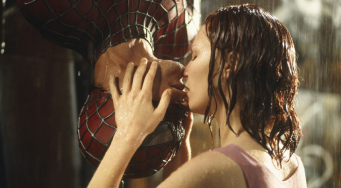

# 🕷️ Spider-Man: Multiverse Landing Page

  

 

  

Uma Landing Page interativa e imersiva celebrando o universo cinematográfico do Homem-Aranha e o Aranhaverso. O projeto reúne os três heróis mais icônicos do cinema — Tobey Maguire, Andrew Garfield e Tom Holland — reunindo detalhes de suas franquias, trailers e galerias de fotos exclusivas em uma experiência visual dinâmica e responsiva.

---

## 🌐 Acesse o Projeto Online

O projeto está totalmente hospedado e pronto para ser explorado de forma interativa, sem precisar instalar nada! Você pode visualizar a Landing Page rodando em tempo real direto pelo seu navegador (computador ou celular):

👉 **[Clique aqui para acessar o Spider-Man Multiverse no GitHub Pages](https://jucianasoares.github.io/multiverse-spiderman-landingpage/)**

---

---

## 🚀 Funcionalidades Principais

*   **Navegação entre Linhas Temporais (Multiverso):** Transição fluida entre as páginas dedicadas a cada versão do Homem-Aranha.
*   **Carrossel 3D Interativo:** Um menu tridimensional moderno projetado para folhear as sagas e trajes com animações fluidas.
*   **Galeria Multiverso Dinâmica:** Visualizador de imagens integrado e responsivo para conferir capturas marcantes de cada filme.
*   **Efeito Lightbox (Fancybox):** Navegação ampliada e otimizada por fotos de alta resolução sem sair da experiência da página principal.
*   **Responsividade Total:** Interface adaptada para smartphones, tablets e desktops.

---

## 🛠️ Tecnologias Utilizadas

O projeto foi desenvolvido utilizando as melhores práticas de Front-End básico e manipulação de scripts:

| Tecnologia / Biblioteca | Função no Projeto |
| :--- | :--- |
| **HTML5** | Estruturação semântica do conteúdo e acessibilidade. |
| **CSS3** | Estilização avançada, Layout Flexbox/Grid e animações 3D. |
| **Fancybox UI** | Biblioteca JavaScript utilizada para o efeito de Lightbox na galeria de fotos. |

---

## 📁 Estrutura de Pastas Visual

A organização dos arquivos físicos do projeto segue a arquitetura abaixo, garantindo caminhos relativos consistentes:

 
multiverse-spiderman-landingpage/
├── index.html                           # Página Inicial (Menu do Multiverso)
├── pages/                               # Páginas individuais dos heróis
│   ├── spiderman-tobey.html
│   ├── spiderman-andrew.html
│   └── spiderman-holland.html
└── assets/
    ├── css/                             # Folhas de estilo (arquivos .css)
    ├── js/                              # Scripts e automações (arquivos .js)
    ├── audio/                           # Trilhas sonoras e efeitos sonoros
    ├── video/                           # Trailers e teasers dos filmes
    └── images/                          # Acervo de mídias organizado por ator
        ├── spiderman-tobey/
        ├── spiderman-andrew/
        └── spiderman-holland/

​---

## ✒️ Desenvolvido por

*   **Juciana Soares** - *Desenvolvimento Front-End* - [GitHub](https://github.com/JucianaSoares)

> 🎓 *Este projeto foi aprimorado e evoluído por Juciana como parte prática dos meus estudos no curso de desenvolvimento Front-End da **DIO (Digital Innovation One)**.*

---

  <i>"Com grandes poderes vêm grandes responsabilidades." 🕸️</i>

---
Desenvolvido e totalmente testado em um ambiente mobile, usando o Termux e o Acode.
